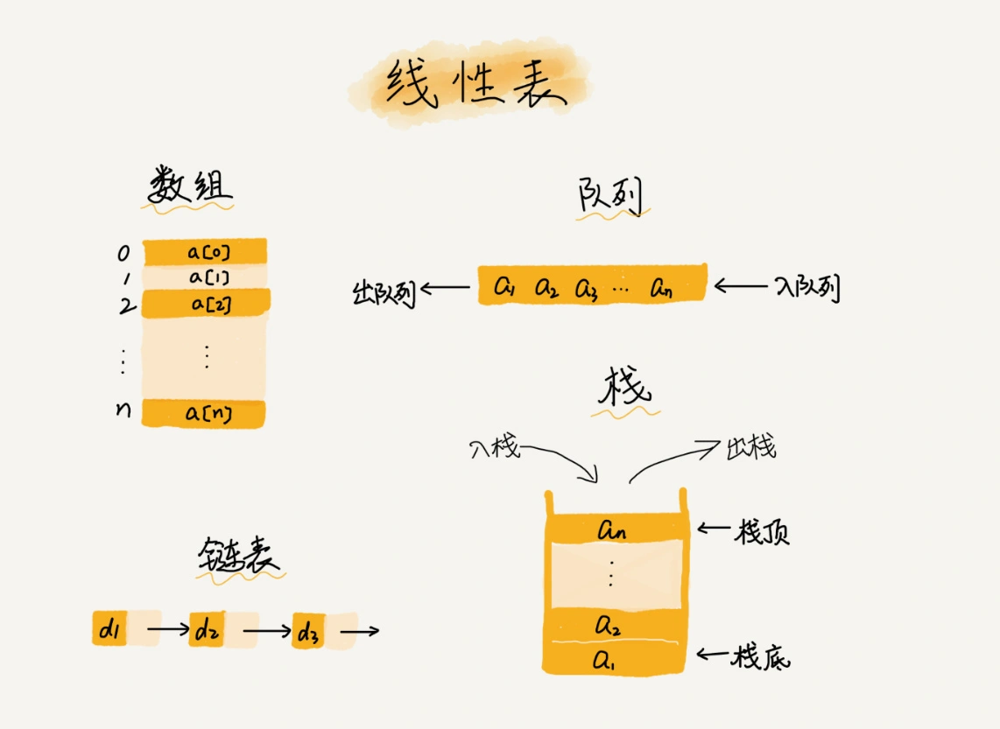

> 为什么数组要从 0 开始编号，而不是从 1 开始呢？

**数组（Array）是一种线性表数据结构。它用一组连续的内存空间，来存储一组具有相同类型的数据。**

- 线性表 (liner list)

线性表就是数据排成像一条线一样的结构。每个线性表上的数据最多只有**前和后**两个方向。其实除了数组，链表、队列、栈等也是线性表结构。


而与它相对立的概念是非线性表，比如二叉树、堆、图等。之所以叫非线性，是因为，在非线性表中，数据之间并不是简单的前后关系。


- 连续的内存空间和相同类型的数据
  
正是因为这两个限制，它才有了一个堪称“杀手锏”的特性：“随机访问”。但有利就有弊，这两个限制也让数组的很多操作变得非常低效，比如要想在数组中删除、插入一个数据，为了保证连续性，就需要做大量的数据搬移工作。

```
// 随机访问数组
a[i]_address = base_address + i * data_type_size

// 如果数组从 1 开始计数，那我们计算数组元素 a[k]的内存地址就会变为：
// 从 1 开始编号，每次随机访问数组元素都多了一次减法运算，对于 CPU 来说，就是多了一次减法指令。
a[i]_address = base_address + ( i - 1 ) * type_size

// 二维数组的内存寻址公式
// 对于 m * n 的数组，a [ i ][ j ] (i < m,j < n)的地址为：
address = base_address + ( i * n + j) * type_size
```

这里我要特别纠正一个“错误”。我在面试的时候，常常会问数组和链表的区别，很多人都回答说，“链表适合插入、删除，时间复杂度 O(1)；数组适合查找，查找时间复杂度为 O(1)”。

实际上，这种表述是不准确的。数组是适合查找操作，但是查找的时间复杂度并不为 O(1)。即便是**排好序的数组，你用二分查找，时间复杂度也是 O(logn)**。所以，正确的表述应该是，数组支持随机访问，根据下标随机访问的时间复杂度为 O(1)。


数组简单易用，在实现上使用的是连续的内存空间，可以借助 CPU 的缓存机制，预读数组中的数据，所以访问效率更高。而链表在内存中并不是连续存储，所以对 CPU 缓存不友好，没办法有效预读。

数组的缺点是大小固定，一经声明就要占用整块连续内存空间。如果声明的数组过大，系统可能没有足够的连续内存空间分配给它，导致“内存不足（out of memory）”。如果声明的数组过小，则可能出现不够用的情况。这时只能再申请一个更大的内存空间，把原数组拷贝进去，非常费时。链表本身没有大小的限制，天然地支持动态扩容，我觉得这也是它与数组最大的区别。

数组声明需要申请一块连续的内存空间，如果系统的内存空间不足则会申请失败，但是在垃圾回收阶段，数组可以采用标记后集中回收，减少垃圾回收次数，减少耗时； 链表在内存中不是连续存储，可以动态的增加内存空间，但链表的内存消耗相对于数组是翻倍的（多了一份指向下一个节点的指针），而且对链表频繁的插入，删除操作，会导致频繁的内存申请和释放，容易造成内存碎片，导致频繁的垃圾回收。


## 删除数组

跟插入数据类似，如果我们要删除第 k 个位置的数据，为了内存的连续性，也需要搬移数据，不然中间就会出现空洞，内存就不连续了。和插入类似，如果删除数组末尾的数据，则最好情况时间复杂度为 O(1)；如果删除开头的数据，则最坏情况时间复杂度为 O(n)；平均情况时间复杂度也为 O(n)。

数组 a[10]中存储了 8 个元素：a，b，c，d，e，f，g，h。现在，我们要依次删除 a，b，c 三个元素。

为了避免 d，e，f，g，h 这几个数据会被搬移三次，我们可以先记录下已经删除的数据。每次的删除操作并不是真正地搬移数据，只是记录数据已经被删除。当数组没有更多空间存储数据时，我们再触发执行一次真正的删除操作，这样就大大减少了删除操作导致的数据搬移。

如果你了解 JVM，你会发现，这不就是 **JVM 标记清除垃圾回收算法的核心思想吗？没错，数据结构和算法的魅力就在于此，很多时候我们并不是要去死记硬背某个数据结构或者算法，而是要学习它背后的思想和处理技巧，这些东西才是最有价值的**。如果你细心留意，不管是在软件开发还是架构设计中，总能找到某些算法和数据结构的影子。

## 警惕数组的访问越界问题
```
// 无限打印 Hello world
int main(int argc, char* argv[]){
    int i = 0;
    int arr[3] = {0};
    for(; i<=3; i++){
        arr[i] = 0;
        printf("hello world\n");
    }
    return 0;
}
```

数组本身在定义的时候需要预先指定大小，因为需要分配连续的内存空间。如果我们申请了大小为 10 的数组，当第 11 个数据需要存储到数组中时，我们就需要重新分配一块更大的空间，将原来的数据复制过去，然后再将新的数据插入。

## 小结

数组。它可以说是最基础、最简单的数据结构了。数组用一块连续的内存空间，来存储相同类型的一组数据，最大的特点就是支持随机访问，但插入、删除操作也因此变得比较低效，平均情况时间复杂度为 O(n)。在平时的业务开发中，我们可以直接使用编程语言提供的容器类，但是，如果是特别底层的开发，直接使用数组可能会更合适。