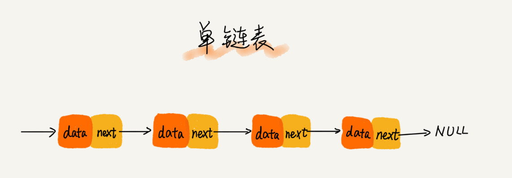
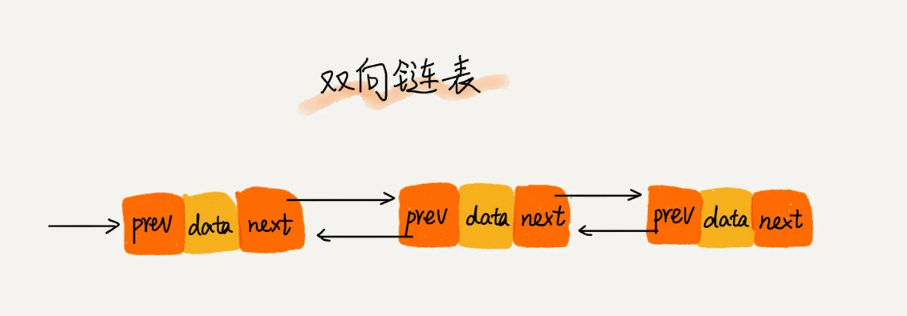

> 缓存淘汰策略：先进先出策略 FIFO（First In，First Out）、最少使用策略 LFU（Least Frequently Used）、最近最少使用策略 LRU（Least Recently Used）

## 数组和链表的区别

对内存要求方面: 数组对内存的要求更高。因为数组需要一块连续内存空间来存放数据。（可能出现的问题就是:内存总的剩余空间足够，但是申请容量较大的数组时申请失败） 链表对内存的要求较低，是因为链表不需要连续的内存空间，只要内存剩余空间足够，无论是否连续，用链表来申请空间一定会成功。 但是要注意:链表虽然方便。但是内存开销比数组大了将近一倍，假设存储100个整数，数组400个字节的存储空间足够了。但是如果用链表存储100个整数，链表得需要800个字节的存储空间，因为链表中的每个节点不止要存储数据，还要**存储地址**，内存的利用率就比数组低太多了。 由此还可以得出:如果内存容量本身就很小，要存储的数据也比较多。选择数组来存储数据更好，如果内存空间充足，那我们在存储数据的时候到底选择链表还是数组。这个就视具体的业务场景而定了

链表结构五花八门，常见的有：单链表，双向链表，循环链表

## 单链表
  

  从图中我们可以看出，针对链表的插入和删除操作，我们只需要考虑相邻结点的指针改变，所以对应的时间复杂度是 O(1)。
  

循环链表是一种特殊的单链表。实际上，循环链表也很简单。它跟单链表唯一的区别就在尾结点。

## 双向链表

双向链表需要额外的两个空间来存储后继结点和前驱结点的地址。所以，如果存储同样多的数据，双向链表要比单链表占用更多的内存空间。虽然两个指针比较浪费存储空间，但可以支持双向遍历，这样也带来了双向链表操作的灵活性

**双向链表的插入，删除等操作要比单链表简单、高效**

在实际的软件开发中，从链表中删除一个数据无外乎这两种情况：
- 删除结点中“值等于某个给定值”的结点；
  **单链表时间复杂度 O(n), 双向链表时间复杂度O(n)**
- 删除给定指针指向的结点。
  **单链表时间复杂度 O(n), 双向链表时间复杂度O(1)**

  双向链表设计思想：**空间换时间**

## 如何写错正确的链表代码

- 理解指针或引用的含义
  
  将某个变量赋值给指针，实际上就是将这个变量的地址赋值给指针，或者反过来说，指针中存储了这个变量的内存地址，指向了这个变量，通过指针就能找到这个变量。
  ** 函数中需要移动链表时，最好新建一个指针来移动，以免更改原始指针位置。**

- 警惕指针丢失和内存泄漏

- 利用哨兵简化实现难度
  
- 重点留意边界条件处理
  
  - 如果链表为空时，代码是否能正常工作？
  - 如果链表只包含一个结点时，代码是否能正常工作？
  - 如果链表只包含两个结点时，代码是否能正常工作？
  - 代码逻辑在处理头结点和尾结点的时候，是否能正常工作？